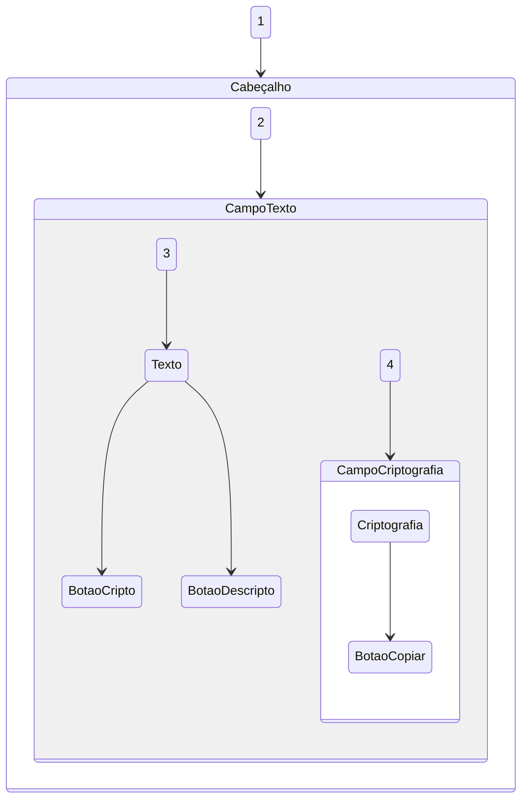

# Decodificador-de-texto-ONE-T6
Challenge Decodificador de texto _ ALURA ONE T6  
Sprint 01: Construa um decodificador de texto com Javascript 

<h2>⚙️Tecnologias Utilizadas</h2>

 

## Estrutura do projeto
 :open_file_folder: Diagrama

EXTRAS: Rodape e botao copiar

## Responsividade :computer: :iphone:
#### -Desktop :computer: 
  

    
  

#### -Tablet 
   

    
  

#### -Celular :iphone:
   

      
    

## Acesse o decodificador e descubra novas formas de se comunicar !! :+1:
Como utilizar:  
1. Clique na imagem da maquina Enigma de Alan Turing
2. Digite a palavra ou frase
3. Clique em Criptografar ou Desincriptografar
4. A resposta ira aparecer na tela do lado direito, aproveite e copie o texto pelo botao copiar e compartilhe!!

*Enigma-Alan Turing*
