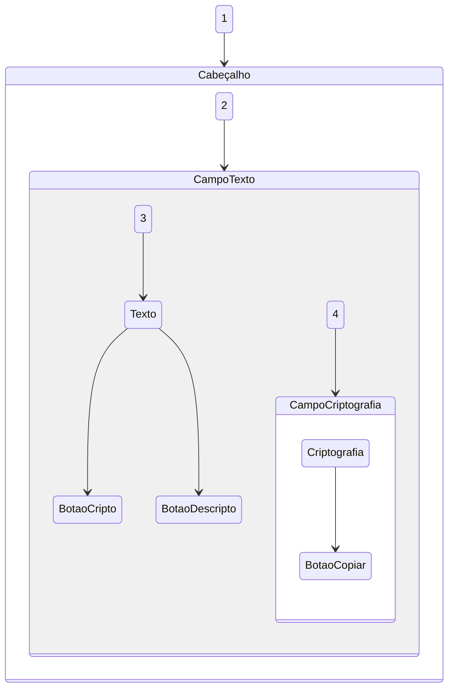

# Decodificador-de-texto-ONE-T6
Challenge Decodificador de texto _ ALURA ONE T6

## Estrutura do projeto
Diagrama

## Responsividade
#### -Desktop []
  

    
  

#### -Tablet []
   

    
  

#### -Celular []
   

      
    

  
